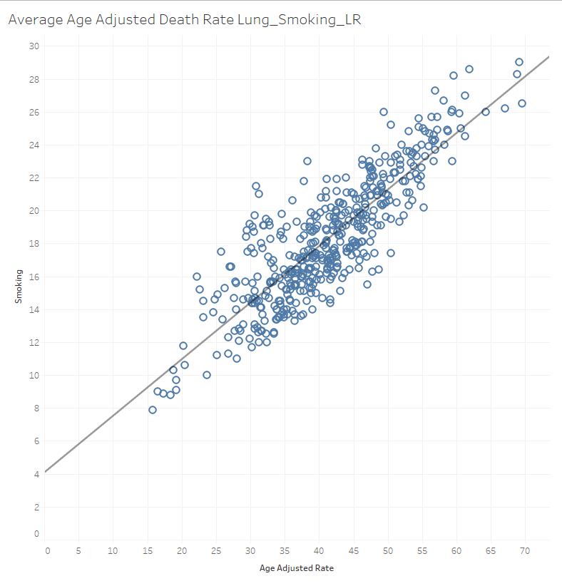

# Group Project Health 

## Team Members and Week 3 Roles
- Ying Ko - Machine Learning, Data cleaning and formatting
- Lindsey Maag - GitHub and Dashboard, Visualizations
- Caitlin Bighem - Presentation, Dashboard, Visualizations
- Mangesh Bore - Database, Data cleaning and formatting
  

<!-- TABLE OF CONTENTS -->
<h2>Table of Contents</h2>
  <ul>
    <li><a href="#link section">Link Section</a></li>
    <li><a href="#project-overview">Project Overview</a></li>
    <li><a href="#topic">Topic</a></li>
    <li><a href="#goal">Goal</a></li>
    <li><a href="#resources">Resources</a>
       <ul>
        <li><a href="#1-united-states-cancer-statistics-uscs">1. United States Cancer Statistics (USCS)</a></li>
        <li><a href="#2-united-states-per-capita-income">2. United States Per Capita Income</a></li>
        <li><a href="#3-united-states-smoking-percentages">3. United States Smoking Percentages</a></li>
      </ul>
    </li> 
    <li><a href="#analysis">Analysis</a></li>
    <li><a href="#machine-learning-model">Machine Learning Model</a></li>
    <li><a href="#results">Results</a></li>
    <li><a href="#recommendations">Recommendations</a></li>
  </ul>
  

## Link Section 

**Download Presentation** [Google Slide Presentation](https://docs.google.com/presentation/d/1qDphhR6iy6LWQZMR-FTrf8-2vGju6G8aBF8bE3vS4zU/edit#slide=id.g1679ac1ab82_0_1689)

**Tableau Dashboard** [Tableau Dashboard](https://public.tableau.com/app/profile/caitlin.bighem/viz/GroupHealthProject/Obesity_RateMap1?publish=yes)

**Final Web App** [Dashboard Site](https://bc-group-project-health.herokuapp.com/)

Plans for interactive elements included layered maps and other interactive data visualizations

(<a href="#readme-top">back to top</a>)

## Project Overview
The purpose of this project is to use U.S. Cancer Statistics to analyze the relationship between cancer data and U.S. Income Per Capita. 

(<a href="#readme-top">back to top</a>)

## Topic
When first forming our groups for the Final Project, our initial thought was of working with a healthcare related topic and corresponding resources as some of our team members come from this background. 

(<a href="#readme-top">back to top</a>)

## Goal 
The goal of this project is to implement a machine learning model that can determine what if any correlation there is between a citizens income level and their likelihood for an incidence of cancer. The model will indicate whether a higher income per capita will lead to a lower mortality rate. With this goal in mind, we expect to see a strong correlation between cancer survival rates and higher income per capita as well as a parallel between mortality rate and lower personal income.

(<a href="#readme-top">back to top</a>)

## Resources
### 1. United States Cancer Statistics (USCS) [Link](https://docs.google.com/presentation/d/1qDphhR6iy6LWQZMR-FTrf8-2vGju6G8aBF8bE3vS4zU/edit#slide=id.g1679ac1ab82_0_1689)
 
- Data Source: Center for Disease Control
- The preeminent source of data on cancer incidence is medical records. Medical professionals and staff at health care facilities pull data from patients' medical records. If the facility has its own cancer registry, they will enter the data there and send it to the national or state registry. Examples of these data sources include general practitioners office, radiation facilities, surgical centers and oncology laboratories.
- The cancer mortality statistics have been gathered based on information from death certificates filed within the 50 states, the District of Columbia, and Puerto Rico.
 
### 2. United States Per Capita Income [Link](https://apps.bea.gov/iTable/iTable.cfm?reqid=70&step=1&acrdn=2)

- Data Source: Bureau of Economic Affairs, Mid-Year population estimate by the Census Bureau.
- BEA produced intercensal annual state population statistics for 2010 to 2019 that are tied to the Census Bureau decennial counts for 2010 and 2020. 
- BEA used the Census Bureau Das Gupta modified method to account for an extra leap year day.
- Per capita personal income is total personal income divided by the total mid-year population.
- Note: All dollar estimates are in millions of current dollars (not adjusted for inflation). Calculations are performed on unrounded data.
- Last updated: September 30, 2022--revised statistics for 2017-2021.
 
### 3. United States Smoking Percentages [Link](https://www.statista.com/statistics/261595/us-states-with-highest-smoking-rates-among-adults/)

[2018 Adult Smoking Rate by State](https://www.cdc.gov/tobacco/data_statistics/fact_sheets/adult_data/cig_smoking/index.htm#states)

[2019 Adult Smoking Rate by State](https://www.cdc.gov/statesystem/cigaretteuseadult.html)

[2020 Adult Smoking Rate by State](https://www.tobaccofreekids.org/assets/factsheets/0176.pdf)

- Data Source: Center for Disease Control
- Adults who reported that they currently smoked every day or some days. 
- Percentages are weighted to reflect population characteristics. 
 

(<a href="#readme-top">back to top</a>)

## Analysis
Questions answered as a result of this analysis:
- Is there a relationship between cancer incidence and mortality rate to income?
  - Our linear regression analysis shows little correlation between state, all cancer mortality rate, and state per capita income between 1999 and 2019 with R@ of only 5%
    - Our dataset spans over 21 years and during this period, per capita income steadily increases due to inflation and economic expansion while cancer motality rate decreased, most likely as a result of better screening and health care technology, all of these factors have contributed to the lower correlation between income and cancer mortality.

- Does race affect cancer incidence and mortality rate? - USE MORTALITY RATE VS RACE, 
  - Black individuals have a higher mortality rate than white individuals in comparison with incidence rate
  - Other three races have lower incidence and mortality rate than indivudlas whose race is Black or White

  - Mortality to incidence ratio: 0.23 

- Do race and sex affect lung cancer incidence and mortality rate?
    - Female smokers have lower lung cancer death rate than men

- Any unusually high or low rate of lung cancer incidence rate by State?
  - Highest incidence rate:
    - West Virginia - 26.26%
    - Kentucky - 25.79%
    - Arkansas - 24.03%
  - Lowest incidence rate:
    - Utah - 9.57%
    - California - 11.88%
    - Hawaii - 13.83%

- Top 5 cancers for Males 
  1. Lung
  2. Prostate
  3. Colon & Rectum
  4. Pancreas
  5. Liver
- Top 5 cancers for Females
  1) Lung
  2) Breast
  3) Colon & Rectum
  4) Pancreas
  5) Ovary

- What are the top states with the highest death rate of smokers with lung cancer?
  - Kentucky: 62.54%
  - Arkansas: 54.70%
  - Mississippi: 54.46%

(<a href="#readme-top">back to top</a>)

## Machine Learning Model
ML modeling goal is to try to find factors that may contribute to site-specific cancer death rate. In order to complete this analysis here are the steps we took: 

Step 1)
- Preliminary data preprocessing:

  - Our primary [cancer dataset](https://github.com/Lindsey-Maag/Group_Project_Health/blob/main/Resources/BYAREA.TXT) is provided by the CDC.The dataset contains state-level annual data covering 1999 to 2019 with   detailed information on site-specific incidence rates and mortality rates that are further split into specific sex and race   group.  The total raw dataset contains 959,077 records.  

  - Our initial clean-up eliminated duplicate information, transformed data types, and dropped fields and rows with missing     data. 
    - [Data Transformation Notebook](https://github.com/Lindseey-Maag/Group_Project_Health/blob/main/byarea_data_transform.ipynb)
    - [Resulting Dataframe](https://github.com/Lindsey-Maag/Group_Project_Health/blob/main/Resources/cleaned_byarea_df.csv)

  - In addition, we collected:
    - [Annual state-level data on obesity from CDC](https://github.com/Lindsey-Maag/Group_Project_Health/blob/main/Resources/obesity_rate.csv)
    - [Annual state-level data on smoking from CDC](https://github.com/Lindsey-Maag/Group_Project_Health/blob/main/Resources/smoking_rate.csv)
    - [Annual state-level per capita income from BEA](https://github.com/Lindsey-Maag/Group_Project_Health/blob/main/Resources/per_capita_income.csv)
    - We may add more as we develop our ML models

Step 2)
- [Initial data exploration](https://github.com/Lindsey-Maag/Group_Project_Health/blob/main/byarea_data_exploration.ipynb):
  - Preliminary feature selection, including their decision-making process:
    - We investigated various cancer rate measurements as the target for our ML models.  We found that the age-adjusted       mortality rate gave us the best results in our [linear regression](https://github.com/Lindsey-Maag/Group_Project_Health/blob/main/LinearRegression.ipynb) ML models.
    - In the [LinR_LungCancer_Smoking.ipynb notebook](https://github.com/Lindsey-Maag/Group_Project_Health/blob/main/LinR_LungCancer_Smoking.ipynb), we use the reported lung cancer death rate per 100,000 population as the independent variable for our linear regression ML model against smoking rate as the dependent variable.  In this case, our model produced an R-square of 57%.  In the [LinR_AgeAdj_LungCancer_Smoking.ipynb notebook](LinR_AgeAdj_LungCancer_Smoking.ipynb) we were able to improve R-square to 73% when we used aged-adjusted lung cancer death rate.
    
    
    
    
    - Description of how data was split into training and testing sets:
      -We split our smoking and lung cancer death relationship data using standard sklearn train_test_split method with random state of 78. We were able to achieve an R-square of 72% with the training dataset, while the testing dataset produced an R-square of 76%. We believe these results demonstrated our linear regression model does not have any overfitting issues. See [LinR_AgeAdj_LungCancer_Smoking.ipynb notebook](https://github.com/Lindsey-Maag/Group_Project_Health/blob/main/LinR_AgeAdj_LungCancer_Smoking.ipynb) for details code and outputs.

  - Explanation of model choice, including limitations and benefits:
    - We started our model exploration with linear regression to test out the best target choice and get a better understanding of our core dataset.  We find good results for our linear regression model when we look at the relationship between lung cancer death and smoking.
    - We are expanding our exploration to other models, such as [multiple regression](https://github.com/Lindsey-Maag/Group_Project_Health/blob/main/MR_Cancer_Mortality.ipynb) and [random tree](https://github.com/Lindsey-Maag/Group_Project_Health/blob/main/mortality_incidence_randomforest_analysis.ipynb), during week 3 and hope to find other interesting relationships and trends within our cancer dataset.

## Results
- Multiple regression for lung cancer is 68% testing and 75% training
- Linear regression for lung cancer is 76% testing and 72% training
- At 0.0% smoking rate, the lung cancer death rate would be 6.7 (intercept).
- For every 0.2% of smoking rate increase, there will be an increase of 1 on deathrate. (coef)

(<a href="#readme-top">back to top</a>)

## Recommendations
- Further analysis can be done by including obesity rates and confirming how they may or may not contribute to cmorality and incidence rates of specific cancers.
- 5 states with highest cancer rates?
- 5 states with lowest cancer rates?
- One way to investigate the relationship between income and death rate further is to look at data within a smaller time frame.  Maybe analyze one-year data at the county level or ideally patient level.

(<a href="#readme-top">back to top</a>)

